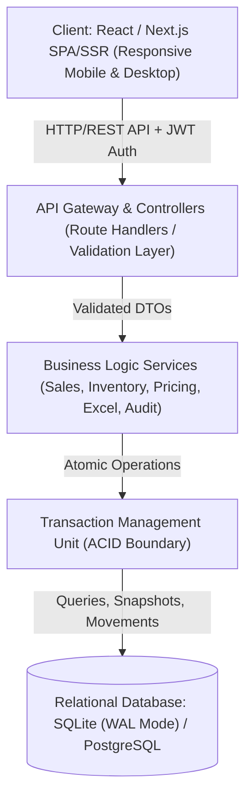

# KIẾN TRÚC HỆ THỐNG QUẢN LÝ SHOP ĐỒ CHƠI (T_SHOP)
**Hệ thống Quản lý Bán hàng, Sản phẩm, Kho & Báo cáo Shop Đồ chơi Trẻ em**

---

## 1. TỔNG QUAN KIẾN TRÚC (HIGH-LEVEL ARCHITECTURE)

Hệ thống được thiết kế theo mô hình **Transaction-Based Layered Architecture**, đáp ứng tiêu chuẩn phần mềm bán lẻ chuyên nghiệp:
* **Data-First**: Dữ liệu lịch sử giao dịch và giá không bao giờ bị ghi đè (Append-Only / Versioned Snapshots).
* **ACID Transactions**: Mọi biến động kho và bán hàng được thực hiện trong database transaction cô lập.
* **Fast & Lightweight**: Tối ưu hóa cho môi trường vận hành thực tế tại cửa hàng, độ trễ thao tác ghi nhận bán <= 5s, tải trang tức thì.
* **Professional UI**: Giao diện Data-Driven, không animation rườm rà, tối ưu bảng biểu và thao tác bàn phím/di động.



---

## 2. PHÂN TẦNG HỆ THỐNG (LAYERED ARCHITECTURE)

### 2.1. Presentation Layer (Giao diện người dùng)
* **Framework**: React / Next.js (App Router) với Vanilla CSS Design System tối ưu cho quản trị bán lẻ (Không Tailwind, không AI-SaaS glow/neon).
* **State Management & Data Fetching**: SWR / TanStack Query hoặc Native Server Actions/Fetch với caching hợp lý và Server-side pagination/filtering.
* **UI Components**:
  * `DataTable`: Hỗ trợ sticky header, sorting, server filtering, pagination, footer tổng, export.
  * `QuickSaleForm`: Giao diện ghi nhận bán nhanh (tối ưu mobile, numeric steppers, autofocus, snapshot preview).
  * `ExcelUploader`: 3 bước: Upload $\rightarrow$ Parse & Validate $\rightarrow$ Preview Diff (New / Update / Unchanged / Error) $\rightarrow$ Commit.
  * `AuditViewer`, `FilterToolbar`, `DateRangePicker`, `ConfirmModal`, `ToastNotification`.

### 2.2. Application / API Layer (Xử lý yêu cầu & Xác thực)
* **Authentication & Authorization**: Session/JWT Token based. Phân quyền RBAC rõ ràng:
  * `ADMIN`: Toàn quyền quản lý, cấu hình giá, xuất/nhập/điều chỉnh kho, import Excel, xem báo cáo & audit log.
  * `STAFF`: Ghi nhận bán, tra cứu sản phẩm, xem tồn kho cơ bản.
* **Input Validation**: Schema validation nghiêm ngặt (Zod/Valibot) cho tất cả request payload trước khi vào Service layer.
* **Standard Response Envelope**:
  ```json
  {
    "success": true,
    "data": { ... },
    "error": null,
    "pagination": { "page": 1, "limit": 20, "total": 150, "totalPages": 8 }
  }
  ```

### 2.3. Domain / Service Layer (Nghiệp vụ cốt lõi)
* **Sales Service**:
  * Xác định giá bán áp dụng theo ngày (`effective_from <= sale_date`).
  * Snapshot `unit_price_at_sale` vào `sales_records`.
  * Trừ tồn kho và ghi nhận `stock_movements` (type = `SALE`).
  * Thực thi toàn bộ trong một Transaction.
* **Pricing Service**:
  * Quản lý `price_history` và `cost_price_history`.
  * Không bao giờ UPDATE giá cũ, chỉ INSERT bản ghi lịch sử mới với ngày áp dụng.
* **Inventory Service**:
  * Xử lý nhập kho (`PURCHASE`), xuất kho (`SALE`, `DAMAGE`, `LOSS`, `GIFT`, `RETURN`, `ADJUSTMENT`).
  * Kiểm soát tồn kho không âm (tuỳ policy), truy vết lịch sử biến động từ đầu kỳ đến cuối kỳ.
* **Excel Engine**:
  * Parse file `.xlsx` / `.xls` an toàn, chống formula injection.
  * Validate từng dòng dữ liệu: SKU tồn tại hay chưa, danh mục/loại sản phẩm, kiểu dữ liệu, ràng buộc nghiệp vụ.
  * Tạo Diff Preview chi tiết trước khi Commit.
* **Audit Service**:
  * Tự động ghi nhận nhật ký thao tác quan trọng (thay đổi giá, điều chỉnh kho, import Excel, ghi nhận bán) kèm `old_value` và `new_value`.

### 2.4. Data Access & Persistence Layer (Lưu trữ & Transaction)
* **Engine**: SQLite với **WAL Mode** (Write-Ahead Logging) + Foreign Keys ON hoặc PostgreSQL. SQLite cho phép triển khai 1 file dữ liệu độc lập, backup dễ dàng, tốc độ đọc ghi cực nhanh cho shop bán lẻ.
* **Indexes**: Đánh index trên `sku`, `category_id`, `product_type_id`, `sale_date`, `created_at`, `effective_from`, `movement_type`.

---

## 3. CÁC NGUYÊN TẮC THIẾT KẾ BẮT BUỘC (CORE DESIGN PRINCIPLES)

1. **Transaction Safety**: Bán hàng / Nhập hàng / Điều chỉnh kho phải commit nguyên khối (Atomic). Lỗi ở bất kỳ bước nào $\rightarrow$ Rollback hoàn toàn.
2. **Snapshot Pricing**: Doanh thu lịch sử = $\sum (\text{quantity} \times \text{unit\_price\_at\_sale})$. Không phụ thuộc vào giá bán hiện tại.
3. **No Direct Hard Deletes**: Sản phẩm có phát sinh giao dịch chỉ chuyển sang trạng thái `inactive`, không xóa cứng để đảm bảo toàn vẹn dữ liệu kế toán/báo cáo.
4. **Excel Import Isolation**: Excel không ghi đè trực tiếp lịch sử giao dịch và giá. Excel chỉ cập nhật master data hoặc tạo transaction nhập mới qua quy trình Preview $\rightarrow$ Commit.
