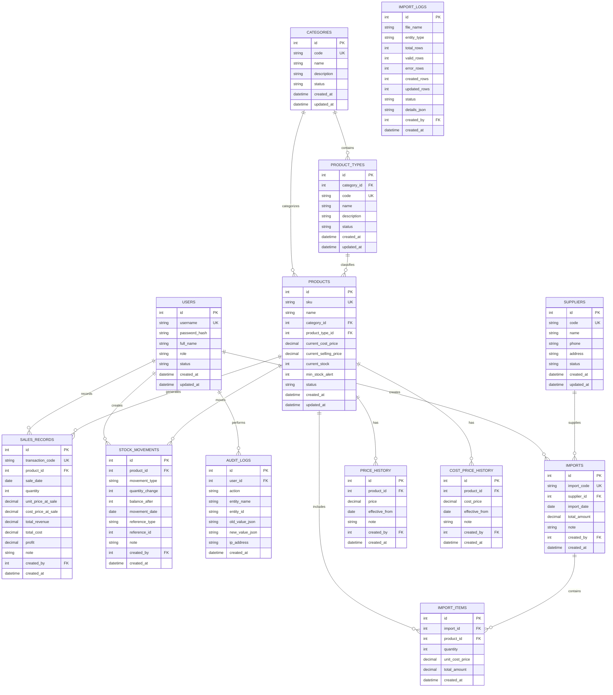

# THIẾT KẾ CƠ SỞ DỮ LIỆU (DATABASE.MD)
**T_SHOP Database Schema & Data Integrity Design**

---

## 1. SƠ ĐỒ THỰC THỂ LIÊN KẾT (ER DIAGRAM)



---

## 2. CHI TIẾT CÁC BẢNG DỮ LIỆU & RÀNG BUỘC (DATA DICTIONARY)

### 2.1. Bảng `users` (Tài khoản người dùng)
| Tên cột | Kiểu dữ liệu | Ràng buộc | Ý nghĩa |
| :--- | :--- | :--- | :--- |
| `id` | INTEGER | PRIMARY KEY AUTOINCREMENT | Mã định danh người dùng |
| `username` | VARCHAR(50) | UNIQUE, NOT NULL | Tên đăng nhập |
| `password_hash` | VARCHAR(255) | NOT NULL | Mật khẩu mã hoá (bcrypt/argon2) |
| `full_name` | VARCHAR(100) | NOT NULL | Họ và tên nhân viên/quản lý |
| `role` | VARCHAR(20) | NOT NULL, CHECK in ('ADMIN', 'STAFF') | Quyền hạn |
| `status` | VARCHAR(20) | DEFAULT 'ACTIVE' | ACTIVE / INACTIVE |
| `created_at` | DATETIME | DEFAULT CURRENT_TIMESTAMP | Ngày tạo |
| `updated_at` | DATETIME | DEFAULT CURRENT_TIMESTAMP | Ngày cập nhật |

### 2.2. Bảng `categories` (Danh mục sản phẩm)
| Tên cột | Kiểu dữ liệu | Ràng buộc | Ý nghĩa |
| :--- | :--- | :--- | :--- |
| `id` | INTEGER | PRIMARY KEY AUTOINCREMENT | Mã danh mục |
| `code` | VARCHAR(50) | UNIQUE, NOT NULL | Mã code (VD: `GAU_BONG`, `LEGO`) |
| `name` | VARCHAR(150) | NOT NULL | Tên danh mục (VD: Gấu bông) |
| `description` | TEXT | NULL | Mô tả chi tiết |
| `status` | VARCHAR(20) | DEFAULT 'ACTIVE' | ACTIVE / INACTIVE |
| `created_at` | DATETIME | DEFAULT CURRENT_TIMESTAMP | Ngày tạo |
| `updated_at` | DATETIME | DEFAULT CURRENT_TIMESTAMP | Ngày cập nhật |

### 2.3. Bảng `product_types` (Loại sản phẩm)
| Tên cột | Kiểu dữ liệu | Ràng buộc | Ý nghĩa |
| :--- | :--- | :--- | :--- |
| `id` | INTEGER | PRIMARY KEY AUTOINCREMENT | Mã loại sản phẩm |
| `category_id` | INTEGER | NOT NULL, FK $\rightarrow$ `categories(id)` | Thuộc danh mục |
| `code` | VARCHAR(50) | UNIQUE, NOT NULL | Mã loại (VD: `CAPYBARA`, `RC_CAR`) |
| `name` | VARCHAR(150) | NOT NULL | Tên loại sản phẩm (VD: Capybara) |
| `description` | TEXT | NULL | Mô tả |
| `status` | VARCHAR(20) | DEFAULT 'ACTIVE' | ACTIVE / INACTIVE |
| `created_at` | DATETIME | DEFAULT CURRENT_TIMESTAMP | Ngày tạo |
| `updated_at` | DATETIME | DEFAULT CURRENT_TIMESTAMP | Ngày cập nhật |

### 2.4. Bảng `products` (Thông tin sản phẩm)
| Tên cột | Kiểu dữ liệu | Ràng buộc | Ý nghĩa |
| :--- | :--- | :--- | :--- |
| `id` | INTEGER | PRIMARY KEY AUTOINCREMENT | Mã định danh sản phẩm |
| `sku` | VARCHAR(50) | UNIQUE, NOT NULL | Mã SKU định danh duy nhất (VD: `GB001`) |
| `name` | VARCHAR(255) | NOT NULL | Tên sản phẩm |
| `category_id` | INTEGER | NOT NULL, FK $\rightarrow$ `categories(id)` | Danh mục |
| `product_type_id` | INTEGER | NOT NULL, FK $\rightarrow$ `product_types(id)`| Loại sản phẩm |
| `current_cost_price` | DECIMAL(15,2)| DEFAULT 0 | Giá nhập hiện hành |
| `current_selling_price`| DECIMAL(15,2)| DEFAULT 0 | Giá bán hiện hành |
| `current_stock` | INTEGER | DEFAULT 0 | Tồn kho hiện tại (cached balance) |
| `min_stock_alert` | INTEGER | DEFAULT 5 | Ngưỡng cảnh báo tồn ít |
| `status` | VARCHAR(20) | DEFAULT 'ACTIVE', CHECK in ('ACTIVE', 'INACTIVE') | Trạng thái kinh doanh |
| `created_at` | DATETIME | DEFAULT CURRENT_TIMESTAMP | Ngày tạo |
| `updated_at` | DATETIME | DEFAULT CURRENT_TIMESTAMP | Ngày cập nhật |

### 2.5. Bảng `price_history` (Lịch sử giá bán theo ngày)
*Quy tắc: Không update bản ghi cũ, mỗi lần đổi giá thêm 1 bản ghi mới.*
| Tên cột | Kiểu dữ liệu | Ràng buộc | Ý nghĩa |
| :--- | :--- | :--- | :--- |
| `id` | INTEGER | PRIMARY KEY AUTOINCREMENT | Khóa chính |
| `product_id` | INTEGER | NOT NULL, FK $\rightarrow$ `products(id)` | Sản phẩm |
| `price` | DECIMAL(15,2)| NOT NULL, CHECK (price >= 0) | Mức giá bán áp dụng |
| `effective_from` | DATE | NOT NULL | Ngày bắt đầu áp dụng |
| `note` | VARCHAR(255) | NULL | Ghi chú lý do đổi giá |
| `created_by` | INTEGER | NULL, FK $\rightarrow$ `users(id)` | Người thực hiện |
| `created_at` | DATETIME | DEFAULT CURRENT_TIMESTAMP | Thời điểm tạo |

### 2.6. Bảng `cost_price_history` (Lịch sử giá vốn/nhập theo ngày)
| Tên cột | Kiểu dữ liệu | Ràng buộc | Ý nghĩa |
| :--- | :--- | :--- | :--- |
| `id` | INTEGER | PRIMARY KEY AUTOINCREMENT | Khóa chính |
| `product_id` | INTEGER | NOT NULL, FK $\rightarrow$ `products(id)` | Sản phẩm |
| `cost_price` | DECIMAL(15,2)| NOT NULL, CHECK (cost_price >= 0) | Mức giá vốn |
| `effective_from` | DATE | NOT NULL | Ngày áp dụng |
| `note` | VARCHAR(255) | NULL | Ghi chú |
| `created_by` | INTEGER | NULL, FK $\rightarrow$ `users(id)` | Người thực hiện |
| `created_at` | DATETIME | DEFAULT CURRENT_TIMESTAMP | Thời điểm tạo |

### 2.7. Bảng `sales_records` (Ghi nhận bán hàng - Snapshot Transaction)
| Tên cột | Kiểu dữ liệu | Ràng buộc | Ý nghĩa |
| :--- | :--- | :--- | :--- |
| `id` | INTEGER | PRIMARY KEY AUTOINCREMENT | Khóa chính |
| `transaction_code` | VARCHAR(50) | UNIQUE, NOT NULL | Mã giao dịch bán (VD: `TX-20260817-0001`) |
| `product_id` | INTEGER | NOT NULL, FK $\rightarrow$ `products(id)` | Sản phẩm bán |
| `sale_date` | DATE | NOT NULL | Ngày bán ghi nhận |
| `quantity` | INTEGER | NOT NULL, CHECK (quantity > 0) | Số lượng bán |
| `unit_price_at_sale` | DECIMAL(15,2)| NOT NULL | Snapshot giá bán tại ngày bán |
| `cost_price_at_sale` | DECIMAL(15,2)| NOT NULL | Snapshot giá vốn tại ngày bán |
| `total_revenue` | DECIMAL(15,2)| NOT NULL | `quantity * unit_price_at_sale` |
| `total_cost` | DECIMAL(15,2)| NOT NULL | `quantity * cost_price_at_sale` |
| `profit` | DECIMAL(15,2)| NOT NULL | `total_revenue - total_cost` |
| `note` | VARCHAR(255) | NULL | Ghi chú |
| `created_by` | INTEGER | NULL, FK $\rightarrow$ `users(id)` | Nhân viên ghi nhận |
| `created_at` | DATETIME | DEFAULT CURRENT_TIMESTAMP | Thời điểm lưu bản ghi |

### 2.8. Bảng `stock_movements` (Lịch sử biến động kho - Append Only)
| Tên cột | Kiểu dữ liệu | Ràng buộc | Ý nghĩa |
| :--- | :--- | :--- | :--- |
| `id` | INTEGER | PRIMARY KEY AUTOINCREMENT | Khóa chính |
| `product_id` | INTEGER | NOT NULL, FK $\rightarrow$ `products(id)` | Sản phẩm |
| `movement_type` | VARCHAR(20) | NOT NULL, CHECK in ('SALE', 'PURCHASE', 'DAMAGE', 'LOSS', 'GIFT', 'RETURN', 'ADJUSTMENT') | Loại biến động |
| `quantity_change` | INTEGER | NOT NULL | Số lượng thay đổi (+ nhập, - xuất) |
| `balance_after` | INTEGER | NOT NULL | Tồn kho sau khi thực hiện biến động |
| `movement_date` | DATE | NOT NULL | Ngày phát sinh biến động |
| `reference_type` | VARCHAR(50) | NULL | Bảng liên kết (`sales_records`, `imports`, `adjustments`) |
| `reference_id` | INTEGER | NULL | ID tham chiếu |
| `note` | TEXT | NULL | Lý do điều chỉnh/ghi chú |
| `created_by` | INTEGER | NULL, FK $\rightarrow$ `users(id)` | Người thực hiện |
| `created_at` | DATETIME | DEFAULT CURRENT_TIMESTAMP | Thời gian ghi nhận |

### 2.9. Bảng `suppliers` & `imports` & `import_items` (Nhập kho từ NCC)
* Quản lý phiếu nhập kho chi tiết, ghi nhận giá nhập cụ thể theo từng lô/lần nhập.
* Khi nhập kho commit, tự động cập nhật `current_stock`, tạo `stock_movements` (type = `PURCHASE`) và thêm vào `cost_price_history`.

### 2.10. Bảng `audit_logs` (Nhật ký kiểm toán)
* Ghi lại chi tiết: Người thực hiện, hành động (`CREATE_PRODUCT`, `UPDATE_PRICE`, `ADJUST_STOCK`, `IMPORT_EXCEL`, ...), giá trị trước và sau (`old_value_json`, `new_value_json`), IP và thời điểm.

---

## 3. INDEXES TỐI ƯU TRUY VẤN (QUERY OPTIMIZATION INDEXES)

```sql
-- Indexes cho tìm kiếm sản phẩm nhanh (autocomplete / search <= 5s)
CREATE INDEX idx_products_sku ON products(sku);
CREATE INDEX idx_products_name ON products(name);
CREATE INDEX idx_products_cat_type ON products(category_id, product_type_id);
CREATE INDEX idx_products_status ON products(status);

-- Indexes cho tra cứu lịch sử giá theo ngày
CREATE INDEX idx_price_history_lookup ON price_history(product_id, effective_from DESC);
CREATE INDEX idx_cost_price_history_lookup ON cost_price_history(product_id, effective_from DESC);

-- Indexes cho báo cáo doanh thu & bán hàng
CREATE INDEX idx_sales_records_date ON sales_records(sale_date);
CREATE INDEX idx_sales_records_product_date ON sales_records(product_id, sale_date);

-- Indexes cho lịch sử biến động kho
CREATE INDEX idx_stock_movements_prod_date ON stock_movements(product_id, movement_date);
CREATE INDEX idx_stock_movements_type ON stock_movements(movement_type);

-- Indexes cho Audit log
CREATE INDEX idx_audit_logs_user_date ON audit_logs(user_id, created_at DESC);
CREATE INDEX idx_audit_logs_entity ON audit_logs(entity_name, entity_id);
```

---

## 4. LOGIC XÁC ĐỊNH GIÁ BÁN THEO NGÀY (PRICE RESOLUTION LOGIC)

Khi người dùng ghi nhận bán vào ngày `X` cho sản phẩm `P`:
```sql
SELECT price 
FROM price_history 
WHERE product_id = :productId 
  AND effective_from <= :saleDate 
ORDER BY effective_from DESC, id DESC 
LIMIT 1;
```
Nếu không tìm thấy lịch sử trước ngày `X`, hệ thống sẽ lấy `products.current_selling_price` làm fallback mặc định và tự động chèn bản ghi khởi tạo.
Sau đó, giá trị này được snapshot cố định vào `sales_records.unit_price_at_sale`.
Mọi báo cáo doanh thu chỉ tính toán dựa trên `sales_records.unit_price_at_sale`.
